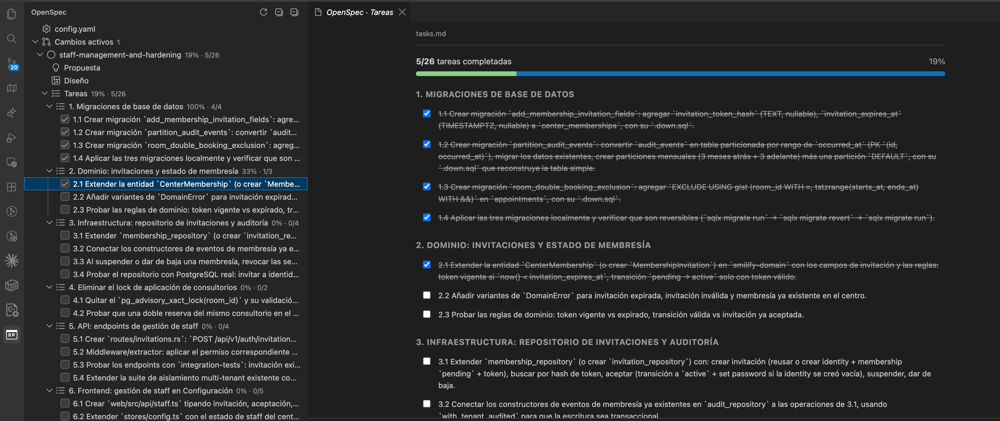
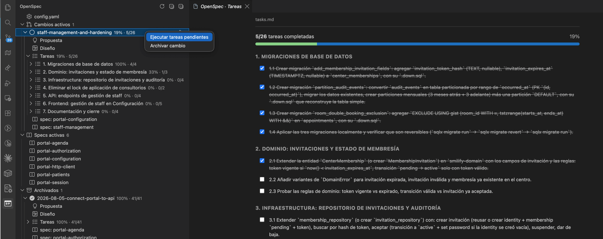

# OpenSpec Previewer

A dedicated VS Code extension to preview and navigate [OpenSpec](https://openspec.dev/) projects without opening every `.md` file by hand.

## Preview

Interactive task tree and themed `tasks.md` preview with live progress:



Per-change inline actions (run pending tasks / archive), active specs and archived changes:



## Features

- **Dedicated sidebar** (OpenSpec icon in the Activity Bar) with a navigable tree:
  - **Active changes** → each change shows its task progress (`8/10 · 80%`).
    - Artifacts: Proposal, Design, Tasks and spec deltas.
  - **Active specs** (per capability).
  - **Archived** (completed changes).
- **Rendered preview** of any `.md`, themed to match the editor (light/dark).
- **Interactive tasks**: toggle checkboxes from the tree or from the preview and the real `tasks.md` is rewritten.
- **Auto-refresh** on file changes inside `openspec/`.
- **Monorepo support**: detects multiple `openspec/` folders in the workspace.
- **Per-change actions** (inline buttons):
  - ▶ **Run pending tasks**: appears when a change has incomplete tasks. Opens the integrated terminal in the project folder and writes the configured agent command (Claude Code by default). For safety it is **not executed**: you review and press Enter.
  - 📦 **Archive change**: appears when all tasks are complete (or there are none). Asks for confirmation and runs `openspec archive`.
- **New proposal** (➕ in the view toolbar): asks for the requirement/change description and launches the configured agent (`openspec.proposalCommand`).
- **Validation** (`openspec validate`): active changes are validated in the background; invalid ones show a ⚠️ icon with the messages in the tooltip and clickable entries in the **Problems** panel.
- **Show impact** (diff): on a spec delta, opens a native diff of the delta against the current active spec — review the intent without reading code.
- **Filter & search**: filter active changes (all / only pending / only completed) and search by id from the view toolbar.
- **Initialize OpenSpec**: when no `openspec/` is found, the welcome view offers a button that runs `openspec init`.
- **Dashboard** (📊 in the view toolbar): a full analytics page with charts — KPIs, completion donut, progress distribution, **linear progress map** (colored by progress), **velocity** (tasks completed per week), per-change bars, monthly bars and a timeline table; with **Active / Archived** tabs.

## Languages

The extension is localized and follows the VS Code display language:

- **English** (default)
- **Spanish** (`es`) — automatically used when VS Code runs in Spanish.

## Requirements

- VS Code `^1.84.0`.
- A workspace containing an `openspec/config.yaml` file (activates the extension).
- Optional: the [`openspec` CLI](https://openspec.dev/) on your `PATH` to archive changes.

## Extension Settings

| Setting | Default | Description |
|---|---|---|
| `openspec.applyCommand` | `claude "/openspec:apply ${changeId}"` | Agent command used to apply tasks. Variables: `${changeId}`, `${cwd}`. |
| `openspec.archiveCommand` | `openspec archive ${changeId} -y` | Command used to archive a change. Variables: `${changeId}`, `${cwd}`. |
| `openspec.autoRunApply` | `false` | When `true`, the apply command runs instantly instead of only being written to the terminal. |

## Commands

| Command | Description |
|---|---|
| `OpenSpec: Refresh` | Reloads the tree. |
| `OpenSpec: Preview` | Opens the rendered preview of a file. |
| `OpenSpec: Open source file` | Opens the underlying `.md`. |
| `OpenSpec: Collapse all` | Collapses the whole tree. |
| `OpenSpec: Run pending tasks` | Sends the agent command to the terminal. |
| `OpenSpec: Archive change` | Archives a completed change. |
| `OpenSpec: Close spec (create deprecation change)` | Creates a deprecation change for an active spec. |

## Recognized OpenSpec structure

```
openspec/
├── config.yaml
├── specs/<capability>/spec.md
└── changes/
    ├── <change-id>/
    │   ├── proposal.md
    │   ├── design.md
    │   ├── tasks.md
    │   └── specs/<cap>/spec.md
    └── archive/
```

## Development

```bash
npm install
npm run compile      # single build
npm run watch        # build in watch mode
```

Press `F5` in VS Code to open a development window with the extension loaded.

## Packaging

```bash
npm run package
npx @vscode/vsce package   # generates the installable .vsix
```

## Release Notes

See [CHANGELOG.md](CHANGELOG.md).

## License

[MIT](LICENSE)
